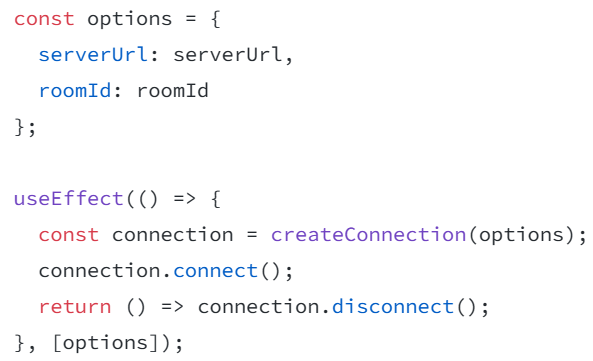

# ReactDocStudy
React 공식 문서 사이트에서 배운 내용 학습 Repository

URL : https://react.dev/learn/tutorial-tic-tac-toe#setup-for-the-tutorial

## Section 1
- React Component들은 일반 태그와 구분하기 위해 반드시 대문자로 시작해야 한다. 

  그렇지 않았을 경우, 다음과 같은 오류 발생
  

- React 태그는 한번에 하나의 Component를 반환해야 한다. 그렇지 않을 경우에는  태그로 \<div> 혹은 \<>태그로 감싸야 한다.

  \<> 태그로 감싼 경우, 반환될 때에는 <>를 제외한 나머지 태그들이 반환됨

- class 사용시 "className" attribute 사용

- js로부터 데이터를 태그로 전달할 때에는 {객체.property} / {변수}와 같은 형태로 전달

  css에 데이터를 전달하고 싶다면 style={{ key : value }}와 같은 형태로 전달하기 (style를 객체 형태로 전달하기 위함)

- 동일한 Type의 Sibling Component 사이에는 각각의 Component를 구별하기 위한 "Key" attribute가 필요

- Component들이 상태값을 갖게 하고 싶다면, React의 useState(초기값) 사용하기 
    ```
    function Comp(){
        ...
        const [변수, set변수] = useState(초기값);
        ...
    }
    ```

- 부모 Component에서 자식 Component로 전달하는 데이터를 props라고 지칭

- Project \<Tic Tac Toe> : 
    
    - Component: Game, Board, Square

    - [핵심] 🎉Game이 유일하게 statue를 가지는 Component -> 게임 데이터가 우측의 button과 좌측의 board간 연동을 위한 "최소 공통 부모"이기 때문 🎉

    - 부모에서 자식에게 Handler를 넘겨주고, 자식에서 handler를 부착하고 이벤트를 발생시키면 부모의 statue(상태값) 업데이트 

      -> 자동으로 자식들도 상태 업데이트