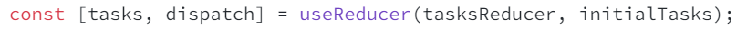

# ReactDocStudy
React 공식 문서 사이트에서 배운 내용 학습 Repository

URL : https://react.dev/learn/tutorial-tic-tac-toe#setup-for-the-tutorial

<details>
  <summary style="font-size: 25px">Section 1</summary>
  
- React Component들은 일반 태그와 구분하기 위해 반드시 대문자로 시작해야 한다. 

  그렇지 않았을 경우, 다음과 같은 오류 발생
  

- React 태그는 한번에 하나의 Component를 반환해야 한다. 그렇지 않을 경우에는  태그로 \<div> 혹은 \<>태그로 감싸야 한다.

  \<> 태그로 감싼 경우, 반환될 때에는 <>를 제외한 나머지 태그들이 반환됨

<br>

- class 사용시 "className" attribute 사용

<br>

- js로부터 데이터를 태그로 전달할 때에는 {객체.property} / {변수}와 같은 형태로 전달

  css에 데이터를 전달하고 싶다면 style={{ key : value }}와 같은 형태로 전달하기 (style를 객체 형태로 전달하기 위함)

<br>

- 동일한 Type의 Sibling Component 사이에는 각각의 Component를 구별하기 위한 "Key" attribute가 필요

  없다면 오류 발생 및 index를 key로써 사용

  


  다음과 같이 Component를 연속적으로 선언할 때에는 오류 구문이 발생하지 않지만, 리스트 타입으로 Component를 매핑시키려 할 때 ({리스트}) 오류 발생

  또한, sibling 간에 unique하지 못한 값을 사용한다면 추후, update / delete 시 문제가 발생할 확률 👆

  Ex) index를 key로 사용하고 첫번째 Component를 삭제했을 때, re-render 되면서 두번째 컴포넌트의 값이 첫번째 컴포넌트의 값으로 올라가는 현상 발생 가능 

<br>

- Component들이 상태값을 갖게 하고 싶다면, React의 useState(상태의 초기값) 사용하기 
    ```
    function Comp(){
        ...
        const [변수, set변수이름] = useState(초기값);
        ...
    }
    ```
  여기서 변수는 Component가 상태값으로써 관리할 값이고, "set변수이름" 함수는 상태값을 update시킬 수 있는 함수

  "set변수이름"의 함수를 사용한다면 React는 해당 컴포넌트의 변경된 상태값을 가지고 re-render를 시작

  <br>


- 부모 Component에서 자식 Component로 전달하는 데이터를 props라고 지칭

  props는 데이터를 부모로부터 전달 받았을 때, {props key}의 형태로 값 / 함수를 매핑시킬 수 있다. 

  ```
    function Parent() {
      function handleOnClick(e){
        console.log('clicked!');
      }

      return (
        <div>
          <Child text="child" handleOnClick=handleOnClick>
        </div>
      )
    }

    function Child({text, handleOnClick}){
      return (
        <button onClick={handleOnClick}>{text}</button>
      );
    }
  ```

  부모 Component가 update되면, 본인 및 그 하위의 모든 자식 컴포넌트들이 re-render 된다. 

  -> [핵심] 
  
  🎉만약 2개 이상의 자식들로부터 데이터를 가져오거나 자식들끼리 상호작용하는 것을 원한다면, 그 자식들의 상위 Component인 부모 Component에 상태를 선언하고 내려주기 

  🎉설계시 sibling Component 사이에서 상호작용이 일어난다면, 각 state를 최소 부모 Component로 끌어올려서 관리

  <br>

  항상 최소한의 state를 Component에 놓으려고 노력해야 한다. 


<br>

- Project \<Tic Tac Toe> : 
    
    - Component: Game <- Board <- Square

    - [핵심] 🎉Game이 유일하게 statue를 가지는 Component -> 게임 데이터가 우측의 button과 좌측의 board간 연동을 위한 "최소 공통 부모"이기 때문 🎉

    - 부모에서 자식에게 Handler를 넘겨주고, 자식에서 handler를 부착하고 이벤트를 발생시키면 부모의 statue(상태값) 업데이트 

      -> 자동으로 자식들도 상태 업데이트
</details>

<br>

<details>
  <summary style="font-size: 25px">Section 2</summary>

  ### Your First Component
  - JSX문법을 활용할 때, Component의 이름의 첫글자가 소문자면 React는 HTML 태그로, 대문자면 React Component로 판단

  - nested 형태로 Component 생성 시, 버그 및 속도 하락 야기 => 따로따로 구현 필요

  - Component import 시 "imprt ~ from './test'"와 같은 형태로도 js 파일 import 가능.

    다만, ~ from './test.js'와 같이 확장자를 붙여주는 것이 native ES Modules에 적합\

  <br>

  ### Writing Markup with JSX
  - JSX와 React는 서로 별개의 기술. 각각은 따로 사용이 가능하다.

    JSX만을 사용하고 싶다면 babel 라이브러리 설치 필요

  - JSX 문법

    1. 하나의 Root Component가 반한되어야 한다.

        다음과 같이 여러개의 Component를 반환해야 하는 경우, 특정 Tag 혹은 <></>(Fragment) 태그로 감싸야 한다.

        ```
          <h1>title 1</h1>
          <h2>title 2</h2>
          ...

          -> 

          <>
            <h1>title 1</h1>
            <h2>title 2</h2>
          </>
        ```

        * <></> == \<Fragment>\</Fragment>

          Fragment는 아래의 코드와 같이 리스트를 반환할 때 key 지정을 위해 불필요하게 생성되는 Component 제거를 위해 사용
          ```
          function Blog() {
            return posts.map(post =>
              <Fragment key={post.id}>
                <PostTitle title={post.title} />
                <PostBody body={post.body} />
              </Fragment>
            );
          }
          ```

    2. 모든 Tag에는 닫힘 문구가 들어가야 한다.

    3. 대부분의 속성들이 Camelcase로 작성된다.

        기존의 class 속성 -> className


    기존의 HTML을 JSX 문법으로 전화시키기 위해서는 많은 시간 소요 

    -> https://transform.tools/html-to-jsx 사이트에서 바꾸기

  <br>

  ### Javascript in JSX with Culy Braces

  - JSX 안에서 {변수 / 값}를 사용해 가변적으로 데이터를 넣을 수 있다.

    주로 text / 속성 / Component를 넣는데 사용 (Tag에는 적용 X. Ex. <{tag}>Gregorio Y. Zara's To Do List</{tag}> ) 

  - JSX에서 inline으로 style 지정 시 { key: value } 형식으로 전달 필요 

    

  - JSX 내부에서 값에 대한 모든 연산은 {} 안에서 이루어저야 한다. (속성 한정)

    

    문자인 경우는 따로 따로 선언해서 사용 가능

    

  <br>

  ### Passing Props to a Component

  - 부모 Component에서 자식 Component로 데이터를 전달하는 방식은 props를 제외한고 존재 X

    전달 방식

    

  - desctructuring 문법을 사용하면 default parameter value 지정 가능

  

  - props로 객체의 모든 값들을 전달하고 싶다면 다음과 같이 사용 

    

  - [핵심] 🎉아래와 같이 부모 자식간에 JSX 태그로 nested 되어 있다면 부모 Component 자식에 대한 값을 children 인자로 받을 수 있다. 

        

    🎉 즉, 부모 Component는 상위 Component에 의해서 임의의 자식 Component를 가질 수 있다는 의미. 

  - [핵심] 🎉 리액트를 잘 설계하기 위해서는 Component의 재사용성과 예측 가능성에 초점을 두고 개발 필요

    그렇기 위해서, 자식 Component에서는 부모 Component로부터 받은 props를 절대 변경해서 사용하면 안된다.

    그렇다고 모든 데이터를 부모 Component에서 조작해야 한다는 의미는 X

    자식에서는 전달받은 props를 임의로 데이터를 cud하면 안되고 그 형태를 변형하는 것은 괜찮다. 

    

  - props로 전달받은 데이터를 함수의 인자로 넣고 싶다면 {}를 사용하지 않기

<br>

### Conditional Rendering

- React Component에서 null을 반환하면 아무것도 랜더링 되지 않는다. (비추천방식)

- js에서 조건부 랜더링 방식

  1. { 조건식 ? comp1 : comp2 }

  2. { 조건식 && comp }

    js에서는 false에 대해서는 rendering 하지 않는다.

  3. 조건문을 사용하여 변수에 값 삽입 및 활용

<br>

### Rendering Lists

- Array에 저장된 Component들은 {}에 넣어서 한번에 매핑이 가능

  ``` 
    const list = {
      <div key={1}>test1</div>, 
      <div key={2}>test2</div>,
      <div key={3}>test3</div>
    };

    return (
      <div>{list}</div>
    );
  ```

- Array를 Comoponent로 전달하면 반드시 array의 요소들은 서로를 구분해줄 수 있는 key를 가져야 한다.

  이 key는 Component의 이동, 삽입, 삭제에 중요하게 작용 

  Tip. uuid 사용하기

  (자세한 내용은 Section2 내용에서 직접 해보기)

- key의 규칙

  1. key는 sibling 간에 unique해야 한다. (다른 배열 요소들의 key와는 같아도 됨)

  2. key는 한번 할당되면 불변해야 한다. 

      -> re-rendering 시 key를 재생성하면 안된다.

<br>

### Keeping Components Pure

- Pure Function의 조건

  1. 자신의 내부 로직에 대해서만 영향력을 끼치며 함수 호출 전의 변수 및 객체에는 영향을 주지 않는다.

  2. 같은 parameter를 넣었을 때, 같은 result가 도출된다. 

- React는 모든 Component가 pure function으로 구성되어 있다는 가정하에 설계됨 

- React의 Strict Mode는 Component를 만드는 함수를 2번씩 호출

  2개의 결과가 같다면 해당 요소는 pure function으로 판단

  Strict mode를 적용하려면 root Component를 <React.StrictMode>로 감싸주면 된다. 

- Event handler는 Component가 rendering될 때 작동하지 않기 때문에, pure할 필요 x

  만약 적절한 event를 찾지 못했다면 최후의 방법으로 useEffect를 활용해야 한다. 

- React가 purity를 핵심 특징으로 생각하는 이유

  1. Memo를 사용하여 같은 input이 들어온 경우, Component rendering을 생략 가능

  2. side effect가 없기 때문에, deep Component tree를 rendering 하는 중간에 다시 재빠르게 다시 rendering 가능
  (이전에 존재하던 값들에 영향을 주지 않기 때문 )

  <br/>


### Your UI as a Tree

- Render tree는 Component간에 관계를 나타낸다. 

- Dependency tree는 각 모듈이 어떤 모듈을 import 중인지 나타내는 지도

</details>

<br>

<details>
  <summary style="font-size: 25px">Section 3</summary>

### Responsding to Events

- event handler이름은 관습적으로 "handle + 이벤트 이름"을 가진다.

  Ex) handleStartBtnClick

- \<div> / \<button> 과 같은 primitive HTML 태그들이 아닌 React Component에 대해서 handler를 붙일 경우, 관습적으로 "on + 이름(첫글자 대문자)"의 형태로 써준다.

- onScroll 이벤트를 제외한 모든 이벤트는 event propagation이 진행된다. (최초 발생 Component부터 상위 Component까지 이벤트가 전파되는 기능)

  onScroll은 해당 Component에서만 발생

- 만약 event를 capture하고 싶다면 상위 컴포넌트들에 onClickCapture과 같은 형식으로 handler 지정

  (event 발생 순서: capture -> event handler(실제) -> event handler(상위) )

- rendering 함수와는 다르게 event handler 함수는 pure할 필요가 없기 때문에 변수의 값 변경과 같은 변화를 주기 용이 

<br />

### State: A Component's Memory

- Component 내부에 선언된 local 지역변수는 Component가 render 됐을 때 초기화 되고, 값이 변경되어도 re-render 되지 않는다. 

  이 문제를 해결할 수 있는 방법 => useState

- useStatue 사용법

  useState(초깃값): Component의 상태값 선언

  반환값의 첫번째 요소는 상태값을 담을 변수, 두번째 요소는 상태값을 업데이트할 수 있는 setter 함수

  ```
    function Comp () {
      const [data, setData] = useState(0);
    }
  ```

  setter 함수를 통해 값이 업데이트되면 해당 Component는 자동으로 re-render

- Hook: useEffect와 같이 use로 시작하는 React에서 제공해주는 함수

  hook은 반드신 Component나 custom hook의 최상단에 선언되어야 한다.

  조건문이나 반복문에서 선언한다면 오류 발생

- Component 내부에서 원하는 만큼의 state을 선언 가능

  만약 동일한 성격의 여러 statue가 따로 선언되었다면 하나로 묶어서 관리하는 것이 효과적

- state를 가진 Component를 여러개 선언했다면, 각각의 Component는 각자만의 state를 가진다.(독립적)

- 내부적으로 state가 관리되는 방법

  1. 각 Component마다 state pair를 array 형태로 소유

  2. useState를 사용할때마다 다음 차례의 state를 반환해주고 state 내부 index를 하나 증가

  * 이 문법이 가능한 이유는 위에서 설명했듯이 Hook은 Component의 최상단에 선언되어야 한다는 조건으로 인해 항상 동일한 순서로 hook이 호출되기 때문

  참고: https://medium.com/@ryardley/react-hooks-not-magic-just-arrays-cd4f1857236e


<br />

### Render and Commit

- React에서 UI에 Component가 적용되는 프로세스

  1. render를 작동시킨다.

      - render가 trigger되는 조건

        (1) 최초 render 시

          - createRoot 함수가 호출되면서 해당 및 그 하위의 모든 Component의 render 함수 작동

        (2) state 값 update 시 (setter 함수 이용시에만!)

  2. Component를 render한다.

      render가 trigger된 후, React는 Component에게 어떤 형태를 화면에 그릴 것인지 요청

      최초에는 root Component부터 render가 실행되지만 이후에는 render가 trigger된 Component부터 render 실행

      -> Component(1)의 반환값이 이전과 다르다면, 달라진 Component(2)에 대해서 다시 render 실행
      -> Component(2)의 반환값이 이전과 다르다면, 달라진 Component(3)에 대해서 다시 render 실행
      -> ... (재귀적으로 실행)

      * 만약 state가 update된 Component가 React Virtual DOM tree의 상단에 위치한다면 성능 하락 야기 
      -> 최적화 필요

  3. DOM에 rendering한 Component를 반영한다.

    - 최초시, 생성한 모든 DOM node들을 appendChild()를 통해 붙이기

    - re-render시, 달라진 부분만 실제 DOM에 re-render

      -> 효율성 up!

<br/>


### State as a Snapshot

- state의 setter는 현재의 state를 다음 render에 적용할 수 있는 값으로 변경할 뿐이다. 

  [핵심] 🎉 현재 진행되는 render에서 여러번의 state의 setter 호출은 마지막의 setter만 state에 영향을 준다.

  

  다음과 같이 state setter를 동시에 여러번 호출해도 count는 하나씩만 증가

  

  위 사진처럼 setter가 배치되었을 때 button을 누르면 number는 2씩 증가

- 한번의 render 중에는 state값은 setter를 호출하더라도 절대 변경되지 않는다. (snapshot)

  단지 다음번의 render에 대한 state값이 변경될 뿐이다.

  아래의 코드를 보면 number의 초깃값이 0이었을 때 alert로 5가 출력될 것 같지만, 실제로는 0이 출력

  

  비동기적으로 render가 화면에 반영한 후 state를 호출하더라도, 해당 render가 진행됐을 때의 state 값으로 render 진행

  <br/>

### Queueing a Series of State Updates

- render 시 state 값이 고정되는 이유는 state 값을 update 동작은 state의 setter가 모두 호출된 후에 실행되기 때문

   => 이런한 형태의 동작 : Batching

  Batching은 안전한 상태에서만 진행된다.

  안전한 상태의 예시) 버튼의 첫번째 클릭이 form을 disable 시키면 두번째 버튼의 클릭은 다시 제출되지 않는다. 

- 만약 render 시 setter를 통한 state 값의 변경을 원한다면 setter의 인자로 값을 변경하는 함수 전달하기 

  

  setter에 인자로 전달된 함수: updater function

  작동 원리

    1. event handler(setter)가 모두 호출된 후 updater function이 실행되도록 queue에 저장됨

    2. 다음 render 시, queue에 저장된 모든 updater function이 실행되고 최종적으로 update된 state 값을 useState의 반환값으로 전달

  - queue에 전달된 처리 로직 중 update func는 기존의 update가 진행중이던 state의 값을 이어받아 update를 진행하지만, 단순 replace with value 로직은 이전의 update되고 있던 state 값을 무시하고 state에 새로운 값 할당 

  2가지 예시

  - 예시1

    

    버튼을 눌렀을 때: number += 6;

    render 시 state 업데이트 과정

    

  - 예시2

    

    버튼을 눌렀을 때: number = 42;

    render 시 state 업데이트 과정

    

<br />

### Updating Objects in State

- state에 저장된 객체를 다룰 때에는 객체를 복사하든, 새롭게 만들든 기존의 state 객체에 영향을 주어서는 안된다.

  다음과 같은 코드는 위험

  

  이 코드에서 버튼을 누른다고 해서 render가 실행되지 않고 backgroud에서 state의 값만 변경되기 때문에 코드의 버그를 알아차리기 매우 어렵게 된다. 

-  [핵심] 🎉 객체 state의 특정 property만 변경시켜서 state에 반영하고 싶다면, 새로운 객체를 만들어서 setter에 적용시키기!

- 만약 객체의 특정 property만 변경되고 나머지 property는 이전 값과 동일하다면 ... 문법(spread syntax) 사용하기

  

  spread syntax는 객체 property의 1-depth까지밖에 영향을 끼치기 때문에 state가 nested된 객체 형태라면 반드시 재귀적으로 호출 필요

- 여러 input의 값 변경에 대한 event handler에 대해서 한번에 적용하고 싶다면 다음과 같은 코드 작성

    

  e.target.name은 input의 name 속성에 지정한 값을 나타냄

  ->  여러개의 input change event handler에 동일한 handler 지정 가능 


- 만약 state가 deep nested 되어 있고 state의 특정 property만 변경하고 싶다면 immer를 통해 특정 property만 변경하는 코드 작성 가능

  

  위의 코드와 같이 useState 대신 useImmer를 통해 사용 가능

  immer는 setter를 통해 변경된 state의 property 값을 "draft"라는 proxy에 저장해두었다가 추후 state에 적용

- React에서 state 객체의 property 값을 변경(mutate)하는 것을 추천하지 않는 강력한 이유

  1. Debugging

      state의 값을 변경하지 않는다면, state의 이전 값들을 확인 가능

  2. Optimization

      대부분의 React 최적화 전략은 이전 props / state 값과 다음 render 시의 props / state 값이 같다고 판단하는 것

      state값을 변경하지 않는다면 render는 빠르게 동작 (re-render하지 않기 때문)

  3. New feature

      React에서 개발중인 새로운 기능들은 render 중 state가 변경되지 않는다는 가정하에 개발중

<br/>

### Updating Arrays in State

- state 객체와 마찬가지로 array도 immutable 하게 다루어야 한다.

  예를 들어, arr[0] = 'test' / push() / pop() 와 같은 형태로는 사용하면 안된다. 

  객체와 동일하게 새로운 배열을 생성해서 update해주기
  
  


- 배열에 대한 삽입, 수정, 삭제 방법 

  1. 배열에서 특정 요소 삭제: filter

  2. 배열의 요소 변경: map
    
      일부 -> index 사용

  3. 삽입: spread syntax

      중간에 삽입을 원한다면 spread syntax + slice 활용

      ```
      const updateArr = [
        ...arr.slice(0, index),
        , // new component
        ...arr.slice(index)
      ];
      ``` 

- spread syntax는 shallow copy이기 때문에 reference type인 배열의 요소에 대해서는 값을 변경하면 안된다. 

  

  js에서 reference type은 Object인 경우로 array, function, object가 있다. 

- 객체와 동일하게 immer를 사용하여 nested reference type 변수에 대한 수정을 간편하게 할 수 있다. 

  

  Immer가 제공하는 draft라는 객체를 수정하는 것이기 때문에, 기존의 array state는 변경되지 않는다. 


</details>

<br/>

<details>
  <summary style="font-size: 25px">Section 4</summary>

  ### Reacting to Input with State

- 선언적(declarative) 프로그래밍 vs 명령형(imperative) 프로그래밍

  명령형 프로그래밍은 기능의 구현을 위한 "코드의 구조"를 주 관점으로 바라보면서 개발하는 방법

  - 기능에 대한 알고리즘의 구현에 초점

  ```
    function test(arr){
      for(let i = 0; i < arr.length; i++){
        arr[i]++;
      }
    }
  ```

  선언적 프로그래밍은 기능에 초점을 두고 개발하는 방식 

  - 구현보다는 어떤 기능을 구현하는지를 명확하게 보여줌

  ```
    function test(arr) {
      return arr.map(i => i + 1);
    }
  ```

- 명령형 프로그래밍 방법은 당시의 조건에 따른 모든 상황에 대해 프로그래밍 해야 하기 때문에 프로그램이 복잡해질수록 관리가 어려워짐

  -> React가 이 문제를 해결하기 위해서 출시 

  React는 직접적으로 개발자가 UI를 조작하기 보단 "어떤 UI를 표시하고 싶은지"에 집중

  [핵심] 🎉 React는 state 값을 사용해서 UI를 가변적으로 표시

  Ex. isEdit / isSubmitting 와 같은 상태

- React를 통해 선언적 프로그래밍 방법

  1. Component로 보여줄 여러 UI 상태를 식별

      기능 로직 구현 전에 mock 형태의 UI를 먼저 구현
  
  2. 어떤 이벤트가 state의 변화를 불러오는지 결정

  3. useState를 통해 state 저장

      어떤 state 변수를 선언해야 할지 애매모호하다면, 모든 visual state에 대해서 변수 선언

  4. 불필요한 state 삭제

      "최소한의" state를 선언하는 것이 핵심

      불필요한 state 제거를 위한 질문

        1. 이 state 변수가 역설(paradox)를 발생시키는가?

            isSubmitting과 isTyping은 동시에 발생할 수 없는 state

            역설을 발생시키지 않는 state는 제거 대상이 될 수 있다.

        2. 이 state 값이 다른 state를 통해 얻을 수 있는가?


  5. state 값을 변경하는 event handler 부착하기 


### Choosing the State Structure

  - Component에 state 설계 시 Tip

    1. 관련된 state 묶기

        동시에 여러 개의 state를 update 한다면, update 되는 state끼리 묶기 (to Object / array)

        object / array로 묶어야 하는 다른 경우는 얼마나 많은 state가 생겨날지 모를 때

        Ex. 개인정보 info에서 custom info를 추가적으로 계속 늘릴 수 있는 경우

    2. state에 대한 모순 피하기

       isSending & isSent와 같이 서로의 state 값이 같은 값일 수 없고 state 값이 변경됨과 함께 isSending 이후 isSent를 항상 같이 변경해야 할 때는 state가 잘못 선언된 상황

       ```
        function submit(){
          setIsSending(true);
          // sending code
          setIsSending(false);
          setIsSent(true);
        }
       ```

       이럴 경우는 isSending, isSent 라는 2개의 state를 하나의 state 변수에 저장하는 것이 관리에 효율적

    3. 불필요한 state 제거

        다른 state들을 가지고 특정 state 값을 얻을 수 있다면 계산으로 얻을 수 있는 state는 불필요

    4. 중복된 state 제거

    5. 깊게 nested된 state는 피하기

        nested된 state를 flat하게 만들기 위해서는 child를 가지는 property에 값 대신 id를 적고 child 값은 다른 곳에 선언하기 

        

    이 원칙의 궁극적인 목표는 실수를 하지 않으면서 state 값을 쉽게 변경하기 위함

  - useState를 통해 state가 초기화되는 것은 최초에 Component가 render될 때에만 작동

    

    따라서 아래와 같이 변수에 direct로 할당해서 사용하거나 초기화용 prop으로 사용

    

    

  - useState의 초기값으로 object가 전달되면 deep copy가 이루어진다. 

  <br/>

  ### Sharing State Between Components

  - 여러 개의 Component들이 각각의 state를 가졌는데 그 state들이 연동되어야 한다면, 여러 Component들의 최소 공통 부모 Component로 state를 올리고 자식 Component에게 props를 통해 전달하는 방식 이용

    -> lifting state up 방식 

    또한, 중복된 state들이 여러 곳에 퍼져서 관리되기 보단 부모 Component에서 관리하고 자식에게 내려주는 형식이 이후의 유지보수 측면에서도 좋다.

  - uncontrolled Component: state를 가지고 있는 Component

    controlled Component: state를 부모가 가지고 자신에게 props로 전달해주는 Component

  <br />

  ### Preserving and Resetting State

  - Component의 state는 Component에서가 아닌 React단에 존재하며 render tree를 가지고 어느 Component에 속한 state인지 파악

    [핵심] 🎉 Component는 render tree의 어디서 속했는지에 따라 다른 Component로 파악된다

    => 같은 위치에 같은 Component가 온다면 render X

    [핵심] 🎉 만약 같은 Component가 render tree의 같은 자리에서 사라졌거나 동일한 자리에 다른 Component가 온다면 이전 Component는 보존되지 않는다.

    아래의 예시에서 같은 JSX 태그 변수를 활용하고 있지만 render tree에서 다른 위치에 위치하기 떄문에 state가 각각 관리되고 있다.

    

    

    만약 같은 Component가 같은 자리에 사라졌다가 나타난다 하더라도 이미 해당 Component는 render tree에서 사라진 상태이기 때문에 보존되지 않았다. 

    따라서 2번째 Counter는 다시 나타났을 때 0으로 count가 초기화

    

    

    

  - render tree는 반환되는 JSX 태그에서의 Component들 간의 위치, parent-child 등으로 정해진다. 

    ```
      <div>
        <Component />
      </div>
      
      <ol>
        <Component />
      </ol>
      // 2개의 Component는 다른 Component로 간주됨
    ```

  - 만약 re-render될 때 Component 내부의 state 값을 보존(preserve)하고 싶다면 이전 render tree와 re-render tree를 동일하게 가지면 된다. 

  - 이번 장에서 설명한 이유 때문에 Component 선언 function을 nested하게 선언하면 안된다.

    왜냐하면 re-render 될 때마다 Component 선언 function들이 새로 생성될 것이기 때문

    ```
      // nested function example
      function Comp1() {
        function Comp2(){
          return <div>Comp2</div>;
        }

        return <>
          <Comp1/>
          <div>Comp2</div>
        </>;
      }
    ```

  - state 값을 초기화하고 싶다면 다음의 방법 사용

    1. Component를 다른 위치에 생성하기 

        조건에 따른 UI 변경 시나리오가 적을 경우 유용하다.

        아래와 같이 선언하면 동일한 위치에 생성한 Component로 판단되지만

        

        다음과 같이 다른 {}에 Component를 선언한다면 다른 Component로 인식

        

    2. Component에 다른 key를 삽입하기 

        [핵심] 🎉 key를 Component에 props로 삽입해준다면, 동일한 Component type의 같은 key 값을 가진 Component라면 어느 곳에 위치하던 같은 Component로 판단

        아래와 같이 같은 위치에 선언된 Component일지라도 key 값이 다르기 때문에 다른 Component로 판단

        

  - render tree에서 삭제된 Component의 state 보존 방법

    1. 여러 개의 Component를 모두 UI에 올려놓고 현재 필요한  Component만 남기고 나머지 hide (비추천)

    2. 부모 Component로 lifting state up 하기

    3. localstorage와 같은 다른 browser 도구 사용하기

    <br/>

  ### Extracting State Logic into a Reducer

  - event handler 여러 곳에서 state를 직접적으로 수정한다면 보기 어려울 것.

    따라서, 직접적으로 state를 수정하는 외부의 함수인 Reducer를 두고 event handler에서 reducer를 호출하는 형태로 관리

  - useState에서 useReducer로 변경하는 방법

    1. setState 함수를 모두 dispatch 함수를 호출하는 형태로 변경

        dispatch 함수는 "action"이라는 프로퍼티를 전달함으로써 사용자가 어떤 행위를 했는지를 알려주는 형식으로 setState 함수처럼 React에 무엇을 지시하는 형식과는 다르다.

        

        위처럼 dispatch의 인자로 전달한 객체를 "action"이라고 지칭

        action은 최소한의 데이터만 가지도록 설정해야 하고 어떠한 객체의 형태도 가능

    2. reducer 함수 생성

        reducer는 state를 update할 로직을 가지는 함수

        현재의 state와 dispatch를 통해 전달된 action 객체가 인자로 전달되고, update된 state를 return해주어야 한다.

        

        Ex) 관습적으로 action의 종류에 대해서는 switch 문을 사용

        


    3. Component에서 reducer 사용

        아래와 같이, useReducer에는 실제 state update 함수, 초기 state 값을 차례대로 인자로 전달하면 state와 인자로 전달한 state update 함수를 호출해줄 dispatch 함수 전달

        

        

        state를 인자로 전달하기 때문에 Component 외부에 reducer 함수를 선언해서 사용 가능

        -> 다양한 곳에서 사용 가능함으로 유지보수성 증가


    - useReducer의 장단점

      1. 코드 길이

          보통 useState를 사용했을 때 코드의 길이가 적지만 state를 update하는 방식이 각 Component마다 비슷하다면 useReducer가 더 적은 코드 창출

      2. 가독성

          단순한 Component에서는 useState가 직관적으로 읽기 좋지만 Component의 크기가 커짐에 따라 useReducer를 사용하는 것이 읽기 쉬워진다.

      3. 디버깅

          useState를 사용한 경우 모든 state를 update하는 모든 구절의 코드를 돌아보면 디버깅해야 하지만, useReducer를 사용한다면 reducer 함수에 console.log를 찍어봄으로써 빠르게 디버깅 가능

      4. 테스트

          reducer를 pure function임으로 테스트에 용이

    - React 개발 부서에서는 몇몇의 Component에서 state를 update할 때 오류가 자주 발생하거나, 더 복잡한 구조를 Component에 넣으려고 하는 경우에 reducer 추천


    - reducer를 잘 작성하는 방법

      1. reducer는 pure function이어야만 한다.

      2. 사용자의 행동이 여러 데이터에 변화를 주어도, 하나의 action으로 사용자 행동을 처리해야 한다.

          Ex) 사용자가 reset 버튼을 눌렀을 때 5가지의 개인정보 입력란을 초기화 해야 한다면, 5번의 setField가 아닌 1번의 resetForm를 action으로 호출해야 한다.

    - reducer는 immer와 같이 사용될 수 있다.

        

        

</details>

<br/>

<details>
  <summary style="font-size: 25px">Section 5</summary>
</details>